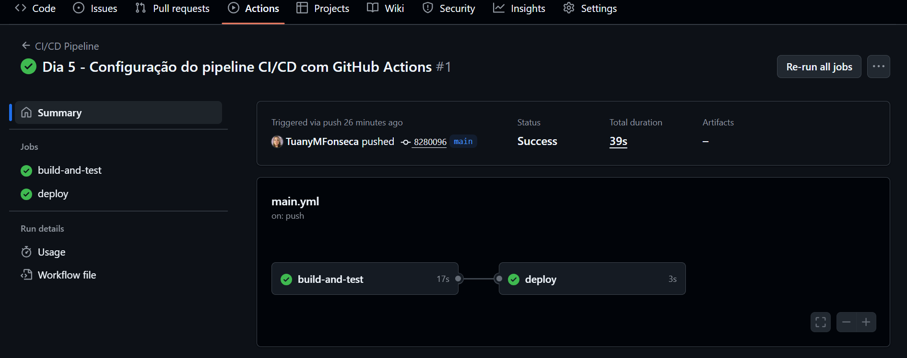

# 🚀 Notification API - CI/CD Pipeline com GitHub Actions

API RESTful para envio de notificações e registro de logs, com pipeline completo de **Integração Contínua (CI)** e **Entrega Contínua (CD)** configurado com **GitHub Actions**.

---

## 🧩 Funcionalidades

- **POST /api/notifications** → Cria e salva uma notificação no log.  
- **GET /api/logs/:user_id** → Retorna todas as notificações associadas a um usuário.  
- **Testes automatizados (Jest + Supertest)**.  
- **Pipeline CI/CD** com GitHub Actions (testes e deploy simulado).

---

## 🛠️ Tecnologias Utilizadas

- Node.js + Express  
- MongoDB (mock / simulação)  
- Jest + Supertest  
- GitHub Actions  

---

## ⚙️ Como Rodar o Projeto Localmente

1️⃣ Clone o repositório:
```bash
git clone https://github.com/TuanyMFonseca/Notification-API-CI-CD
```
2️⃣ Acesse a pasta do projeto:
```bash
cd Notification-API-CI-CD
```
3️⃣ Instale as dependências:
```bash
npm install
```
4️⃣ Inicie o servidor:
```bash
npm start
```
✨A API ficará disponível em:
```
http://localhost:3000
```

## 🧪 Rodando os Testes
```
npm test
```
Exemplo de saída esperada:
```
PASS  src/tests/notification.test.js
  API de Notificações e Logs
    ✓ deve criar uma nova notificação e retornar 201
    ✓ deve retornar 404 quando não houver notificações para o usuário
```
## ⚡ Pipeline CI/CD
O repositório conta com automação via GitHub Actions, configurada em ```.github/workflows/main.yml.```

Fluxo do pipeline:

1. Integração Contínua (CI)
    - Checkout do código
    - Instalação de dependências
    - Execução dos testes automatizados
2. Entrega Contínua (CD)
    - Simulação de build
    - Simulação de deploy em ambiente de homologação

💚 Exemplo de execução no GitHub Actions:



## 🧠 Aprendizados
Durante o desenvolvimento, aprendi sobre:
- Estruturação de APIs RESTful com Express.
- Criação de testes unitários com Jest e Supertest.
- Automação de pipelines com GitHub Actions.
- Boas práticas de versionamento e CI/CD.

## 🏁 Status do Projeto
✅ API funcional

✅ Testes automatizados

✅ Pipeline CI/CD rodando com sucesso

🚀 Pronto para deploy real!

## 👩‍💻 Autora 
 - Tuany Fonseca

[](https://www.linkedin.com/in/tuany-fonseca/)

[](mailto:tuanyfonseca.tech@gmail.com)

---
<p align="center">
  
</p>

<p align="center">
  <b>✨ Obrigado por visitar! Volte sempre! ✨</b>
</p>


